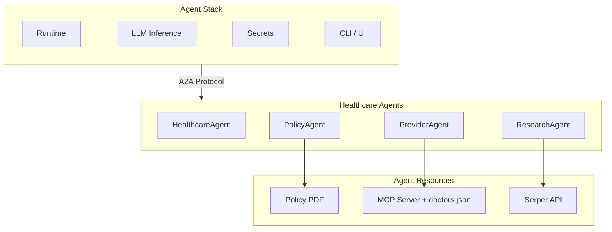

# Agent Stack Healthcare Agents
*Run multi-agent systems as real services with [A2A](https://github.com/a2aproject/A2A) and [Agent Stack](https://agentstack.beeai.dev/stable/introduction/welcome).*

This repo shows how agents built in different frameworks can be run as real services using Agent Stack. The agents communicate over A2A, so they can call each other whether you’re running locally or on a hosted deployment.

You’ll build and run a small multi-agent healthcare system and see how agent workflows move from notebooks to real runtimes.


## Why Agent Stack
In this tutorial, Agent Stack handles the runtime, LLM inference, networking, and service lifecycle for each agent. This lets you focus on agent logic and orchestration, while still running everything as real, callable services—like you would in a production app.

## Agents in this repo

- `healthcare_agent/Agent Stack_agents/healthcare_agent.py`: Concierge/orchestrator that routes questions to the PolicyAgent, ResearchAgent, or ProviderAgent using BeeAI’s RequirementAgent and HandoffTool.
- `policy_agent/Agent Stack_agents/policy_agent.py`: Answers coverage questions by reading `2026AnthemgHIPSBC.pdf` with the LLM provided by the Agent Stack extension.
- `provider_agent/Agent Stack_agents/provider_agent.py`: Finds providers via a custom MCP tool backed by `mcpserver.py` and returns results with an Agent Stack-provisioned LLM.
- `provider_agent/Agent Stack_agents/mcpserver.py`: FastMCP server that lists doctors from `doctors.json`; started on demand by the ProviderAgent.
- `research_agent/Agent Stack_agents/research_agent.py`: Health research agent that searches the web via Serper. Requests and uses `SERPER_API_KEY` through the Secrets extension and runs with the Agent Stack LLM extension.

## Running the agents as services (via Agent Stack)
These agents are run on your local machine's instance of Agent Stack, however, adding agents to a self-hosted version of Agent Stack follows a similar pattern.

1) Install and start Agent Stack using the [quickstart](https://AgentStack.beeai.dev/stable/introduction/quickstart), configuring your LLM provider as Gemini with the preferred model `gemini-2.5-flash-lite`. To configure your Gemini LLM you will need an API Key, which can be obtained from [here](https://aistudio.google.com/app/api-keys).
2) Add the agents through the Agent Stack CLI (replace the release tag with the latest available on GitHub):
   ```bash
   agentstack add https://github.com/sandijean90/AgentStack-HealthcareAgent@release-0.0.16#path=/policy_agent
   agentstack add https://github.com/sandijean90/AgentStack-HealthcareAgent@release-0.0.16#path=/provider_agent
   agentstack add https://github.com/sandijean90/AgentStack-HealthcareAgent@release-0.0.16#path=/research_agent
   agentstack add https://github.com/sandijean90/AgentStack-HealthcareAgent@release-0.0.16#path=/healthcare_agent
   ```
   The platform builds and runs each agent for you—no need to start the servers manually.
3) Set the required environment variable for the ResearchAgent. Replace the API key with your personal key, which can be obtained [here](https://serper.dev/api-keys), and in your CLI run:
   ```bash
   agentstack env add "ResearchAgent" SERPER_API_KEY="Keyvalue"
   ```
4) Start the Agent Stack UI:
   ```bash
   agentstack ui
   ```
5) Test the agents from the UI. Run them individually or run the Healthcare agent to see A2A handoffs across the Policy, Research, and Provider agents. Each agent that is individually run will open a new browser tab, with the Agent Stack home remaining in the original tab.

## Sample Questions to Ask Each Agent

### Helathcare Agent 
* I need mental health assistance and live in Austin Texas. Who can I see and what is covered by my policy?
* I am pregnant and need care in Miami, Florida. What are my options?

### Policy Agent
* Tell me about my policy.
* What is my coinsurance for office visits both in and out of network?

### Provider Agent
* What kind of doctors can I see in Houston Texas?
* I have a rash, who can I see in Los Angeles CA?

### Research Agent
* Tell me about the different types of diabetes.
* What can I do to reduce my cholesterol?

## Known Limitations
- The policy agent only has access to a summary of benefits with limited information and can return "I don't know" (which is a valid response from this agent) depending on the question.
- For demo/illustrative purposes, all agents are called (in a dynamic order) for each task. This may not be necessary depending on the task and can be changed in the conditional requirements to yield better performance.
- The provider agent needs a very specifically formed tool call because of the expected input of the tool on the  mcp server. This can result in a malformed tool call depending on the LLM used and the strength of the system prompt. Future improvements can include a more flexible tool call.

## Next Steps
Want to use this pattern in your own app or internal tool?

This tutorial runs agents as real services using Agent Stack. You can use the same setup to wire agents into your own product or workflows.

#### [Get started with Agent Stack](https://agentstack.beeai.dev/stable/introduction/quickstart)
